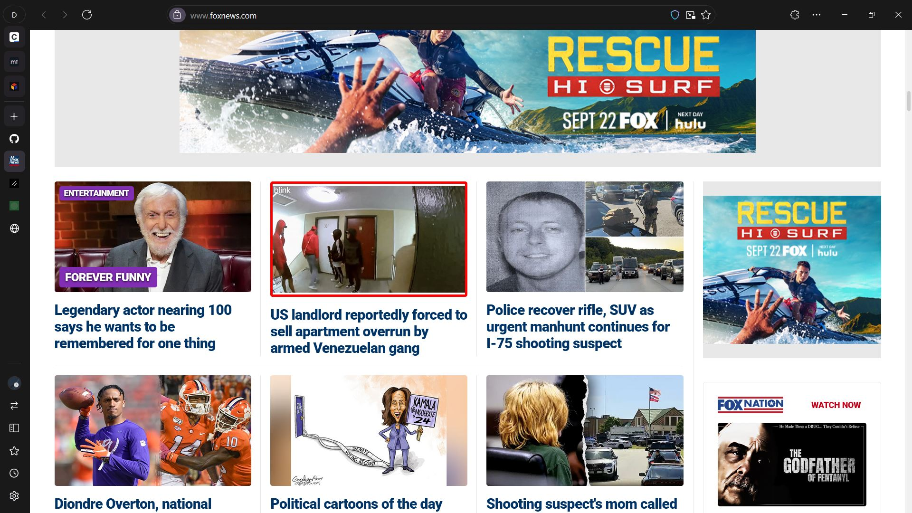
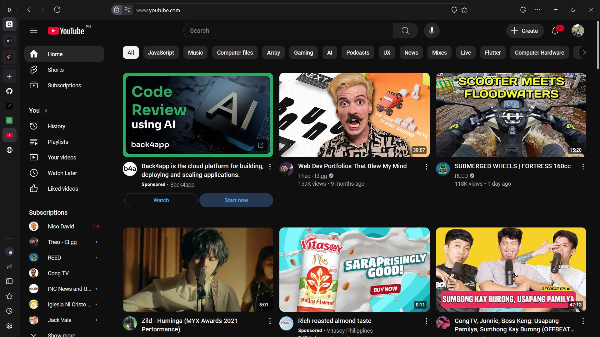
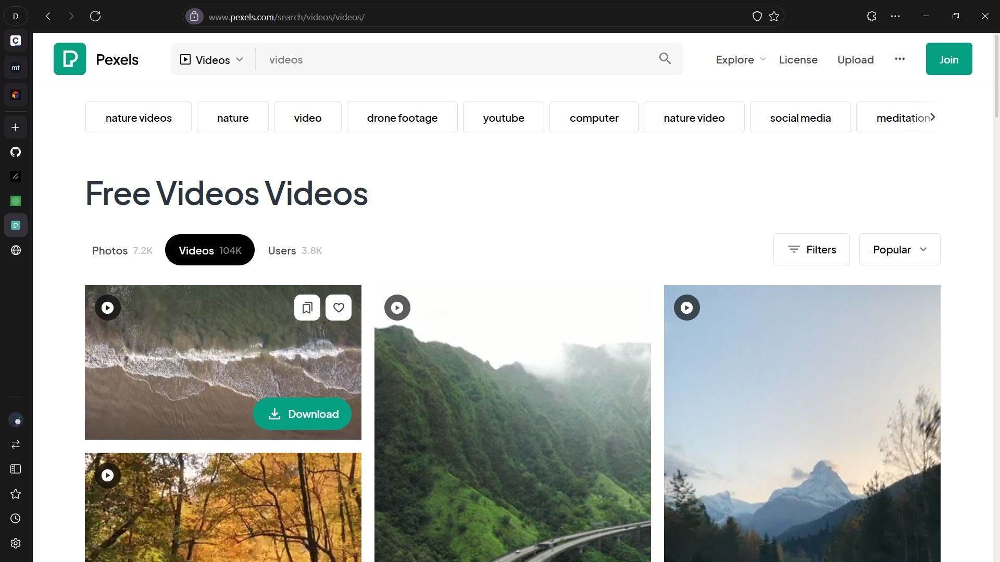

# PRE TEST 3

## Task 1

Audio controls are rather crucial for enhancing user experience with flexible playback, volume adjustment, and skipping/revisiting sections. These features ultimately give users full control over their listening experience, making it so much more personalized and handier.

## Task 2

- **Pros**: Instant playback starts immediately and catches users' attention with no extra clicks, which may be critical for content like breaking news. Second, this might help to increase video visibility, which can bring more views of the videos themselves.

- **Cons**: Auto-play is incredibly frustrating for users who either don't want, or are caught off guard, by the sound of it. Also, it wastes data and is problematic/distracting to users with access needs.

## Task 3

### Streaming Video

### Downloadable Video

Streaming video plays the content in real time over the internet, and users can begin to view the content almost instantly without having to download the file completely. In downloadable video, however, the users need to download the entire file to their devices before they are able to play the videos. With streaming videos, continuous access to the internet is required, whereas downloadable videos do not require access to the internet after the download. While streaming usually occupies less space, it may require a stable connection; downloadable video, in turn, provides more flexibility in offline viewing, provided there is enough storage.

## Task 4
